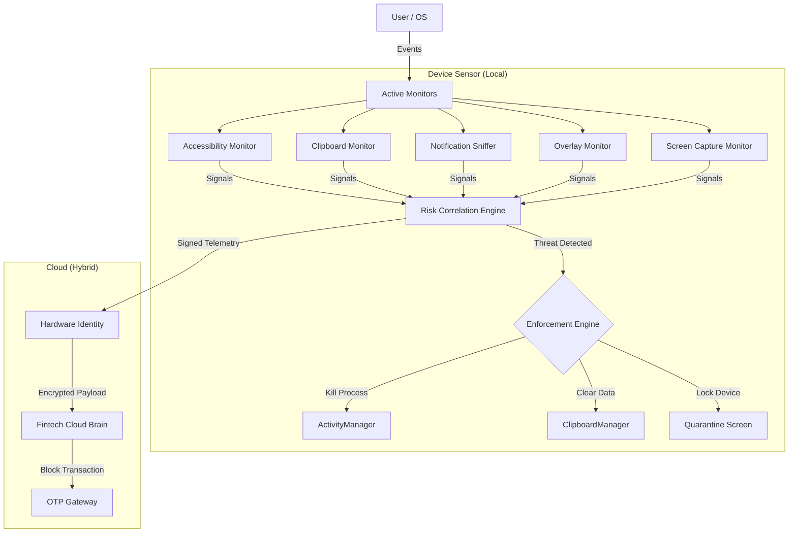
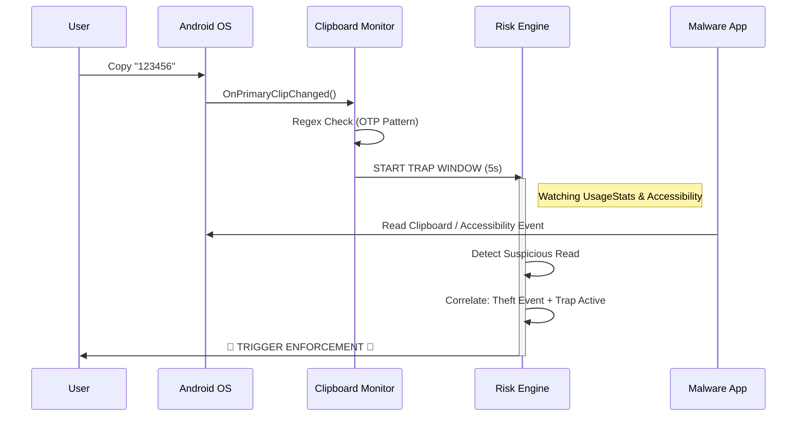

# OTP-FRAME: Behavioral Security Engine

  

**OTP-FRAME** is a hybrid device-cloud security firewall engineered to neutralize advanced financial malware, screens scrapers, and real-time OTP interceptors. Unlike passive antivirus tools, OTP-FRAME operates as an active foreground guardian, leveraging behavioral heuristics to detect and block theft attempts *before* credentials leave the device.

---

## 👨‍💻 Developer

**ANAND BINU ARJUN**

---

## 🏗 System Architecture

OTP-FRAME consists of five independent monitors orchestrated by a central Risk Correlation Engine. The system enforces a zero-trust environment for clipboard data and sensitive notifications.



---

## ⚙️ Logic Flow: The "Trap Window"

When a user copies an OTP, the system enters a hyper-vigilant state. This diagram illustrates the "Trap Window" logic used to catch thieves.



---

## 🖼 UI & Experience

| Dashboard | Quarantine |
|-----------|------------|
| *Real-time visualization of all 5 security monitors with status indicators.* | *Non-dismissible isolation screen triggered upon confirmed threat detection.* |
| `[Dashboard Screenshot]` | `[Red Quarantine Screen]` |

### Features

* **Real-time Sensor Hub**: Visualizes the active status of Accessibility, Overlay, and Clipboard sensors.
* **Inventory Manager**: Allows users to whitelist trusted financial apps to prevent false positives.
* **SaaS-Grade Aesthetics**: Modern Slate/Indigo color palette with card-based analytics.

---

## 🚀 How to Run

### Prerequisites

* **Android Studio** (Hedgehog or newer)
* **Android SDK API 34** (Android 14)
* **Device/Emulator** running Android 13+ (Required for `NotificationListener` and `Accessibility` behaviors).

### Installation Steps

1. **Clone/Open**:

    ```bash
    # Open Android Studio -> Open -> Select Project Folder
    https://github.com/AnandBinuArjun/OTP-FRAME
    ```

2. **Sync Gradle**:
    Wait for the project to index and download dependencies.
3. **Run**:
    Select `app` configuration and press **Run**.

### ⚠️ Critical Post-Install Config

The security engine acts as a system-level guardian. On first launch, you **must enable the following permissions** manually (the app will prompt you, or go to Settings):

1. **Accessibility**: Enable "OTP-FRAME Monitor".
2. **Notification Access**: Grant access to "OTP-FRAME".
3. **Display Over Other Apps**: Allow overlay permission.

---

## � Security Modules Details

1. **Clipboard Monitor**:
    * *Mechanism*: Watches `OnPrimaryClipChanged`.
    * *Trigger*: Regex match for 4-8 digits.
    * *Action*: Opens 5s observation window for background process activity.

2. **Accessibility Anti-Abuse**:
    * *Mechanism*: `AccessibilityService` scanning `TYPE_VIEW_TEXT_CHANGED`.
    * *Trigger*: Third-party app reading "OTP" or "Code" keywords.

3. **Overlay Defense**:
    * *Mechanism*: `PackageManager` scan + Window stack monitoring.
    * *Trigger*: `SYSTEM_ALERT_WINDOW` permission used by non-system apps atop banking UIs.

4. **Hardware Identity**:
    * Generates `EC` keypair in `AndroidKeyStore`.
    * Signs all risk events sent to the cloud loop.

---

**© 2025 OTP-FRAME Project. Developed by ANAND BINU ARJUN.**

